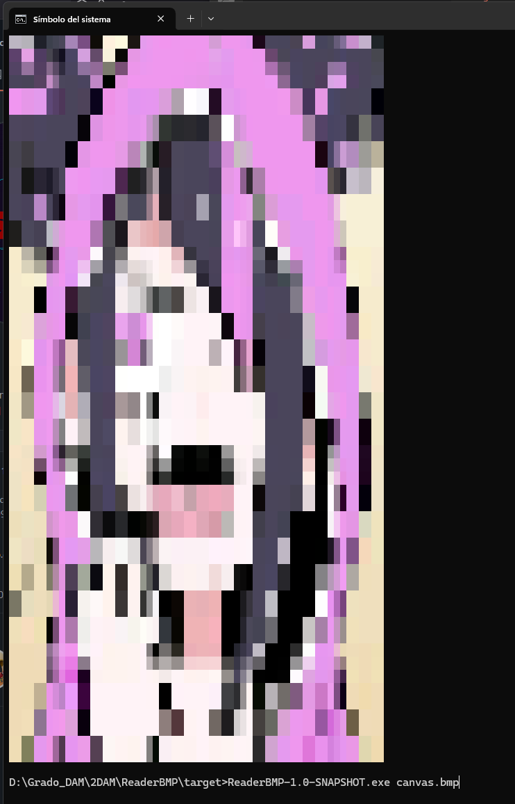

# ReaderBMP

-----

ReaderBMP es una pequeña utilidad para leer archivos bmp, jpg o png en la consola



Ejemplo de uso:

```cmd
D:\Grado_DAM\2DAM\ReaderBMP\target>ReaderBMP-1.0-SNAPSHOT.exe canvas.bmp

```

La herramienta tiene algunas flags utiles:
```js
F:\PersonalJava\ReaderBMP\target>ReaderBMP-1.0-SNAPSHOT.exe -h
Uso: ReaderBMP <archivo_imagen> [opciones]

Opciones:
  -h, --help           Muestra esta ayuda
  -k                   Mantiene BMP convertido
  -s                   Mantiene imagen redimensionada
  -r WIDTHxHEIGHT      Tamaño personalizado (ej: -r 64x64, -r 32x32)

Ejemplos:
  ReaderBMP.exe img.jpg
  ReaderBMP.exe img.jpg -k
  ReaderBMP.exe img.jpg -r 32x32
  ReaderBMP.exe img.jpg -k -s -r 64x64

F:\PersonalJava\ReaderBMP\target>
```

La herramienta leer el jpg, png o bmp, si es uno de los dos primeos formatos, autoconvierte la imagen a bmp conservando la original, para despues hacer una reduccion de la imagen a un tamaño definido por el usuario, por defecto la imagen mostrada en console tiene un tamaño de 64x64 px. Aumentar el tamaño hara que la imagen ocupe mas en su terminal, pero ganara en definicion, esta es una buena opcion si tu terminal puede cambiar el tamaño de la fuente(texto). Una imagen con menos tamaño tiene menos definicion (calidad). Puede usar la opcion `-k` Para mantener el BMP convertido de un PNG o un JPG y puede usar la flag `-s` si desea mantener el archivo redimensionado.

-----